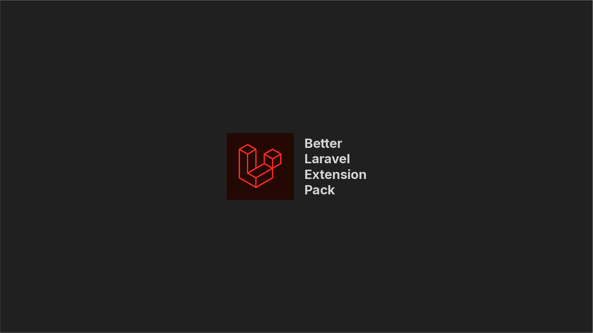

# Better Laravel Extension Pack

Better Laravel Extension Pack for a collection of extensions that help you with Laravel development.

## Installation

```
ext install arifbudimanar.better-laravel-extension-pack
```

## Recommended Settings for minimal and better experience

### settings.json

```json
{
  "[blade]": {
    "editor.defaultFormatter": "shufo.vscode-blade-formatter"
  },
  "[html]": {
    "editor.defaultFormatter": "vscode.html-language-features"
  },
  "[javascript]": {
    "editor.defaultFormatter": "esbenp.prettier-vscode"
  },
  "[javascriptreact]": {
    "editor.defaultFormatter": "esbenp.prettier-vscode"
  },
  "[json]": {
    "editor.defaultFormatter": "vscode.json-language-features"
  },
  "[jsonc]": {
    "editor.defaultFormatter": "vscode.json-language-features"
  },
  "[php]": {
    "editor.defaultFormatter": "open-southeners.laravel-pint"
    // "editor.defaultFormatter": "bmewburn.vscode-intelephense-client"
  },
  "[typescript]": {
    "editor.defaultFormatter": "vscode.typescript-language-features"
  },
  // "window.titleBarStyle": "native",
  // "apc.electron": {
  //   "frame": false
  // },
  "apc.activityBar": {
    "size": 36
  },
  "apc.menubar.compact": true,
  "apc.statusBar": {
    "height": 30
  },
  "blade.format.enable": true,
  "breadcrumbs.enabled": false,
  "database-client.telemetry.usesOnlineServices": false,
  "diffEditor.ignoreTrimWhitespace": false,
  "editor.bracketPairColorization.enabled": false,
  "editor.cursorBlinking": "expand",
  "editor.cursorSmoothCaretAnimation": "on",
  "editor.cursorStyle": "line-thin",
  "editor.fontFamily": "'JetBrains Mono'",
  "editor.fontLigatures": true,
  "editor.formatOnSave": true,
  "editor.hover.sticky": false,
  "editor.inlineSuggest.enabled": true,
  "editor.lineHeight": 3.15,
  // "editor.lineHeight": 2.15,
  // "editor.lineHeight": 48,
  "editor.matchBrackets": "never",
  "editor.minimap.enabled": false,
  "editor.renderLineHighlight": "none",
  "editor.renderWhitespace": "none",
  "editor.smoothScrolling": true,
  "editor.stickyScroll.enabled": false,
  "editor.stickyScroll.scrollWithEditor": false,
  "emmet.excludeLanguages": ["markdown", "php"],
  "errorLens.messageTemplate": "$severity $source - $message  ",
  "explorer.compactFolders": false,
  "explorer.confirmDelete": false,
  "explorer.confirmDragAndDrop": false,
  "files.autoSave": "onWindowChange",
  "git-graph.graph.style": "angular",
  "git.confirmSync": false,
  "gitblame.inlineMessageFormat": "${author.name} - ${time.ago}",
  "gitblame.statusBarMessageFormat": "${author.name} - ${time.ago}",
  "intelephense.telemetry.enabled": false,
  "intelephense.trace.server": "messages",
  "laravel-pint.enable": true,
  "laravel-pint.enableDebugLogs": true,
  "laravel-pint.preset": "laravel",
  "material-icon-theme.activeIconPack": "angular",
  "material-icon-theme.folders.color": "#808080",
  "material-icon-theme.folders.theme": "specific",
  "material-icon-theme.hidesExplorerArrows": true,
  "phpParameterHint.changeDelay": 0,
  "phpParameterHint.fontSize": 14,
  "phpParameterHint.hintTypeName": 2,
  "phpParameterHint.onChange": true,
  "phpParameterHint.onSave": false,
  "phpParameterHint.opacity": 1,
  "phpParameterHint.saveDelay": 0,
  "phpParameterHint.showDollarSign": false,
  "phpParameterHint.textEditorChangeDelay": 0,
  "phpParameterHint.verticalPadding": 0,
  "scm.diffDecorations": "gutter",
  "screencastMode.fontSize": 30,
  "screencastMode.keyboardOverlayTimeout": 5000,
  "screencastMode.verticalOffset": 2,
  "security.workspace.trust.untrustedFiles": "open",
  "telemetry.telemetryLevel": "off",
  "terminal.explorerKind": "external",
  "terminal.integrated.cursorBlinking": true,
  "terminal.integrated.cursorStyle": "line",
  "terminal.integrated.defaultProfile.windows": "Git Bash",
  "terminal.integrated.enableMultiLinePasteWarning": "auto",
  "terminal.integrated.fontFamily": "JetBrainsMono Nerd Font",
  "terminal.integrated.gpuAcceleration": "on",
  "typescript.inlayHints.enumMemberValues.enabled": true,
  "update.mode": "default",
  "window.autoDetectColorScheme": true,
  "window.commandCenter": false,
  "window.title": "${rootName}",
  "workbench.activityBar.location": "hidden",
  "workbench.colorTheme": "ArifCode Theme - Exclusive",
  "workbench.editor.tabActionCloseVisibility": false,
  "workbench.editor.tabCloseButton": "off",
  "workbench.iconTheme": "material-icon-theme",
  "workbench.layoutControl.enabled": false,
  "workbench.list.smoothScrolling": true,
  "workbench.preferredDarkColorTheme": "ArifCode Theme - Windows",
  "workbench.preferredLightColorTheme": "GitHub Light Default",
  "workbench.startupEditor": "none",
  "workbench.statusBar.visible": false,
  "workbench.tree.enableStickyScroll": false,
  "workbench.tree.indent": 16,
  "zenMode.centerLayout": false,
  "zenMode.fullScreen": false,
  "zenMode.hideLineNumbers": false,
  "zenMode.showTabs": "none"
}
```

### keybindings.json

```json
[
  {
    "key": "alt+d",
    "command": "workbench.view.extension.github-cweijan-mysql"
  },
  {
    "key": "alt+t",
    "command": "workbench.view.extension.thunder-client"
  },
  {
    "key": "ctrl+shift+r",
    "command": "-workbench.view.extension.thunder-client"
  },
  {
    "key": "alt+b",
    "command": "workbench.action.toggleActivityBarVisibility"
  },
  {
    "key": "alt+m",
    "command": "workbench.action.toggleMenuBar"
  },
  {
    "key": "alt+n",
    "command": "workbench.action.toggleStatusbarVisibility"
  },
  {
    "key": "ctrl+n",
    "command": "-workbench.action.files.newUntitledFile"
  },
  {
    "key": "ctrl+n",
    "command": "explorer.newFile"
  },
  {
    "key": "ctrl+enter",
    "command": "-github.copilot.generate",
    "when": "editorTextFocus && github.copilot.activated"
  },
  {
    "key": "alt+g",
    "command": "git-graph.view"
  },
  {
    "key": "ctrl+alt+n",
    "command": "-extension.advancedNewFile"
  },
  {
    "key": "ctrl+0",
    "command": "workbench.action.zoomReset"
  },
  {
    "key": "ctrl+numpad0",
    "command": "-workbench.action.zoomReset"
  },
  {
    "key": "ctrl+enter",
    "command": "-github.copilot.generate",
    "when": "editorTextFocus && github.copilot.activated && !inInteractiveInput && !interactiveEditorFocused"
  },
  {
    "key": "alt+i",
    "command": "namespaceResolver.import",
    "when": "editorTextFocus"
  },
  {
    "key": "ctrl+k ctrl+c",
    "command": "workbench.files.action.collapseExplorerFolders"
  },
  {
    "key": "ctrl+k ctrl+shift+w",
    "command": "-workbench.action.closeAllGroups"
  },
  {
    "key": "ctrl+k ctrl+w",
    "command": "-workbench.action.closeAllEditors"
  },
  {
    "key": "ctrl+k w",
    "command": "-workbench.action.closeEditorsInGroup"
  },
  {
    "key": "ctrl+k ctrl+w",
    "command": "workbench.action.closeAllEditors"
  },
  {
    "key": "ctrl+k ctrl+shift+w",
    "command": "workbench.action.closeOtherEditors"
  },
  {
    "key": "ctrl+k ctrl+r",
    "command": "better-pest.run"
  },
  {
    "key": "ctrl+k ctrl+p",
    "command": "better-pest.run-previous"
  },
  {
    "key": "ctrl+k ctrl+f",
    "command": "better-pest.run-file"
  },
  {
    "key": "win+k win+f",
    "command": "-better-pest.run-file"
  },
  {
    "key": "win+k win+r",
    "command": "-better-pest.run"
  },
  {
    "key": "win+k win+p",
    "command": "-better-pest.run-previous"
  }
]
```

### Bash Aliases

```bash
# php artisan command
alias pa='php artisan'
alias pas='php artisan serve'
alias pam='php artisan migrate'
alias pamf='php artisan migrate:fresh'
alias pamfs='php artisan migrate:fresh --seed'
alias pads='php artisan db:seed'
alias pao='php artisan optimize'
alias paoc='php artisan optimize:clear'
alias pakg='php artisan key:generate'
alias parl='php artisan route:list'
alias pat='php artisan test'
alias patp='php artisan test --parallel'
alias patc='php artisan translations:check'
alias pint='./vendor/bin/pint'
alias pest='./vendor/bin/pest'
alias pesttc='./vendor/bin/pest --type-coverage'
alias pestp='./vendor/bin/pest --parallel'

# composer command
alias cu='composer update'
alias ci='composer install'
alias cr='composer require'
alias cdo='composer dump-autoload --optimize'

# npm command
alias ni='npm install'
alias nu='npm update'
alias nrd='npm run dev'
alias nrb='npm run build'

# navigation command
alias ll='ls -alF'
alias la='ls -A'
alias l='ls -CF'
alias ..='cd ..'
alias ...='cd ../..'
alias ....='cd ../../..'
alias .....='cd ../../../..'
alias cdc='cd /c'
alias cdd='cd /d'
alias cdh='cd ~'
alias cdl='cd /d/Laravel'
alias c='clear'

# other command
alias st='speedtest'
alias bashrc='code ~/.bashrc'
alias bashrcs='source ~/.bashrc'
alias hosts='code C:/Windows/System32/drivers/etc/hosts'
alias catssh='cat ~/.ssh/id_rsa.pub'
```
